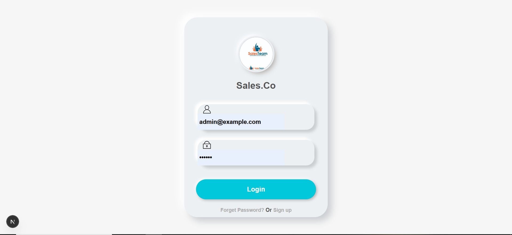
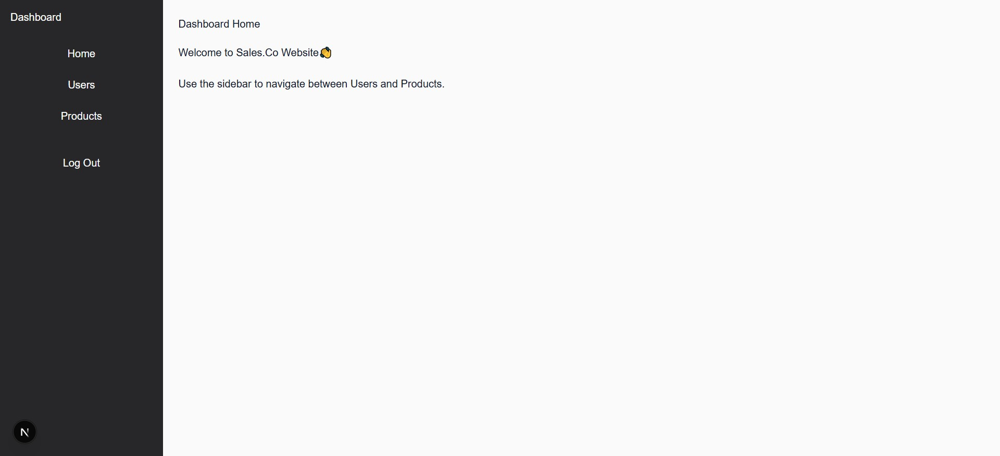
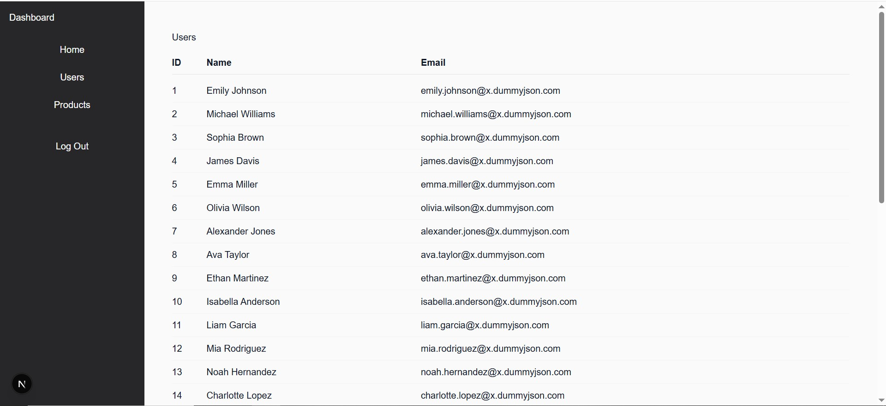
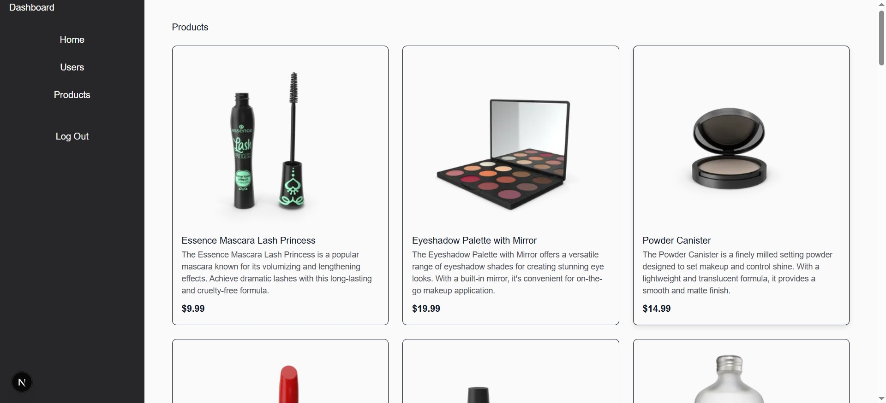

📌 Task 1 – Authentication & Dashboard System
🔐 Important – Login Credentials

When opening the project for the first time, you will be redirected to the login page.

Use the following credentials to access the main dashboard:

Username: admin@example.com  
Password: 123456

You must enter these credentials to access the main application.

📖 Project Overview

This project is a frontend dashboard application built with:

Next.js (App Router)

TypeScript

React Context API (for authentication)

Custom HTML/CSS Login Design

The application includes:

Authentication system (Login)

Protected dashboard routes

Persistent login using localStorage

Custom styled login page

Route protection logic

🚀 Features
✅ Authentication System

Login with predefined credentials

User state managed with React Context

Authentication persists after page refresh

Logout functionality

Automatic redirect to login if user is not authenticated

✅ Protected Dashboard

Dashboard cannot be accessed without login

Unauthorized users are redirected to /login

✅ Custom Designed Login Page

Fully custom HTML & CSS design

Responsive layout
Styled inputs and animated button
Clean UI structure

## Screenshots

### 🔐 Login Page

### 🏠 Dashboard Home

### 👥 Users Page

### 📦 Products Page

📂 Project Structure (Important Parts)

frontend-test/
│
├── public/
│   ├── file.svg
│   ├── globe.svg
│   ├── next.svg
│   ├── vercel.svg
│   └── window.svg
│
├── Screenshots/
│   ├── Home.jpg
│   ├── Login.jpg
│   ├── Products.jpg
│   └── Users.jpg
│
├── src/
│   │
│   ├── app/
│   │   │
│   │   ├── (auth)/
│   │   │   └── login/
│   │   │       └── page.tsx        → Login Page
│   │   │
│   │   ├── dashboard/
│   │   │   ├── layout.tsx          → Protected Dashboard Layout
│   │   │   ├── page.tsx            → Dashboard Home
│   │   │   ├── users/
│   │   │   │   └── page.tsx        → Users Page
│   │   │   └── products/
│   │   │       └── page.tsx        → Products Page
│   │   │
│   │   ├── favicon.ico
│   │   ├── globals.css
│   │   ├── layout.tsx              → Root Layout
│   │   ├── page.tsx                → Redirect to /login
│   │   └── providers.tsx           → Auth Provider Wrapper
│   │
│   ├── components/
│   │   ├── Sidebar.tsx
│   │   ├── Navbar.tsx
│   │   └── ProtectedRoute.tsx (optional if used)
│   │
│   ├── context/
│   │   └── AuthContext.tsx         → Authentication Logic
│   │
│   └── features/
│       └── auth/
│           └── authService.ts (if used)
│
├── package.json
├── tsconfig.json
└── README.md

Clean UI structure

🛠 Installation & Running the Project
1️⃣ Clone the repository
git clone https://github.com/parsabdr-dev/dashboard-with-react.js-next.js.git

2️⃣ Navigate into project folder
cd dashboard-with-react.js-next.js

3️⃣ Install dependencies
npm install

4️⃣ Run development server
npm run dev

Then open:

http://localhost:3000

You will be redirected to the login page.

🔒 Authentication Logic

Authentication is handled using:

AuthContext.tsx

React Context API

localStorage for session persistence

If no user exists in localStorage, the dashboard route automatically redirects to /login.

🎯 Technical Highlights

Built with Next.js App Router

Client-side route protection

TypeScript implementation

Clean project structure

Custom styled UI

Context-based authentication

👨‍💻 Author

Frontend Developer – Task 1 Implementation
Built as part of frontend assessment project.
Styled inputs and animated button

